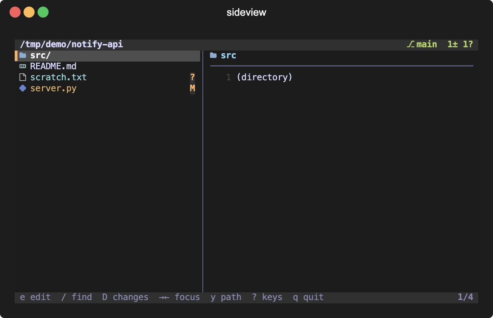

# sideview

[](https://github.com/orikerbis/sideview/actions/workflows/test.yml)

A zero-dependency, vim-style file navigator + git dashboard TUI, built to
live in a side terminal pane next to your editor. Pure Python stdlib
(curses) — no pip installs.



## Highlights

- **Git-aware file tree + preview**: status colors, branch/ahead-behind
  header, syntax highlighting, per-file diffs (`d`), auto-refresh
- **Changes view** (`D`): one live, pretty repo-wide diff — watch an AI
  agent's edits land in real time; **follow mode** (`F`) auto-jumps to
  the newest change
- **Git actions from the pane**: stage/unstage, **generated
  Conventional-Commits messages** (`c` review in `$EDITOR`, `C` instant,
  both without leaving the TUI), push, discard, delete
- **Fuzzy finder** (`/`), full **mouse support** (click, wheel,
  drag-resize, drag-copy), per-repo **persistence**, VSCode-style
  colored **file icons**, **tokyonight** theme with graceful fallback

## Install

```bash
pipx install git+https://github.com/orikerbis/sideview   # as a package
# or, from a clone:
ln -sf "$PWD/sideview" ~/.local/bin/sideview

sideview --doctor         # check your setup (fonts, editor, git, claude)
```

Zero-config: the icon font auto-installs on first run if missing (opt out
with `SIDEVIEW_NO_FONT_INSTALL=1`), the editor auto-detects (`nvim`, then
`vim`). Requires Python 3.9+ and a [Nerd Font](https://www.nerdfonts.com)
for the default icons — or run with `SIDEVIEW_ICONS=emoji`.

## Upgrade

```bash
pipx upgrade sideview-tui        # pipx install (pipx reinstall also works)
# or, from a clone:
git -C path/to/sideview pull     # the symlink picks the update up instantly
```

## Usage

```bash
sideview              # watch the current directory
sideview ~/myproject  # watch a specific one
tmux split-window -h -l 50 'sideview ~/myproject'   # as a side pane
```

## Keys

Press `?` inside sideview for the full reference with explanations.

| Key | Action |
|---|---|
| `j`/`k`, `gg`/`G`, `Ctrl-d`/`u` | move / top-bottom / half page |
| `l` / `h` / `Enter` | expand dir / collapse / toggle dir |
| `e` | edit file in `$EDITOR` |
| `/` | fuzzy find (`↑`/`↓` browse, `e` open, `Esc` cancel) |
| `D` | changes view: live repo-wide diff (`[` `]` hunks, `Esc` exits) |
| `F` | follow mode: auto-jump to the newest change |
| `s` / `u` | git stage / unstage |
| `c` / `C` | commit: generated message in editor / instant, in-TUI |
| `P` | git push |
| `X` `X` | discard changes to selected file |
| `x` `x` | delete selected file from disk |
| `Tab`, `→`/`←` | focus tree ↔ preview (focused pane gets the motions) |
| `d` / `p` | toggle diff view / preview pane |
| `/` (in preview), `n`/`N` | search inside the file or diff |
| `y` / `Y` | copy file path / contents |
| `?` | key reference overlay |
| `<` `>`, `.`, `r`, `q` | resize split, hidden files, refresh, quit |

Mouse: click select, double-click open, wheel scrolls, drag the separator
to resize, drag over preview lines to copy (`⌥` for native selection).
